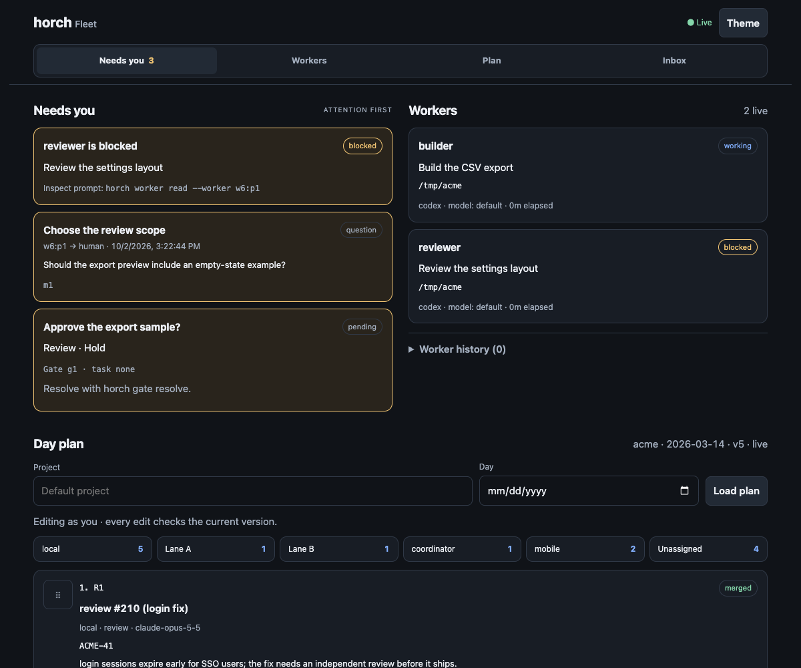
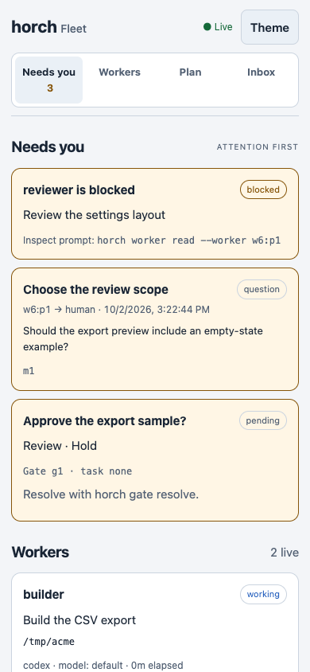
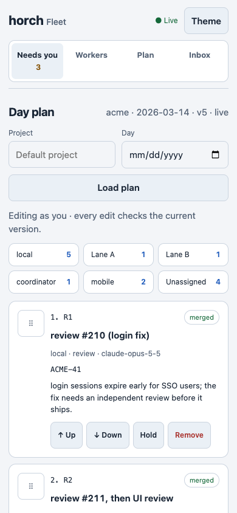

# herdr-orch

[](LICENSE)


**Let one coding agent run a team of others inside [herdr](https://herdr.dev).** herdr already
knows what every agent in every pane is doing (`working`, `idle`, `blocked`, `done`).
herdr-orch adds the coordination layer on top: a mailbox, blocking questions, tasks with
dependencies, dispatches that are tracked until the worker reports back, human decision gates,
and worker teardown that proves the agent process is gone.

Agents (and you) drive it with one CLI, **`horch`**:

```bash
horch run create --title "Refactor auth"                      # you are now the coordinator
horch worker start --agent codex --worktree ../auth-a --name a1
horch task create --title "Extract token store" --spec-file spec.md
horch dispatch --task t1 --to a1                               # prompt sent, tracked
horch check --wait                                             # blocks until something happens
# … "task t1 completed by w4:p1: extracted TokenStore, PR #42"
horch worker release --worker a1                               # closes the pane, verifies no process survives
```

## Why

Running several agents in parallel breaks down in the same few places:

- **Did it finish?** A worker going quiet is not proof of anything. herdr-orch settles a dispatch
  only when the worker runs `horch done` **and** herdr shows it is no longer working.
- **It needs a decision.** `horch ask` blocks the worker until the coordinator (or you) replies,
  instead of a question scrolling past in a pane nobody is watching.
- **Silence.** A worker that stops without reporting is escalated to the coordinator with the end
  of its screen. It is never auto-failed or re-dispatched behind your back: long loops, CI waits
  and background jobs look exactly the same.
- **Orphans.** "Release" closes the pane and checks every process that was in it is gone
  (SIGTERM/SIGKILL for stragglers). It refuses when the worktree has uncommitted or unpushed work.

## Features

- **Mailbox:** `send`, `check [--wait]`, blocking `ask` / `reply`, an inbox per pane, broadcast to a run.
- **Tasks:** dependencies (`--deps a,b`) with automatic readiness, cycle detection, a circuit
  breaker after N failed attempts, optional auto-dispatch to idle workers.
- **Tracked dispatch:** the task spec is wrapped with the exact `horch done` command the worker must
  run. horch settles on the worker's report plus herdr's agent state, and escalates a worker that is
  blocked at a prompt, idle without reporting, or never started.
- **Decision gates:** block a task on a human question with fixed options. Resolve from the CLI or the
  gate popup.
- **Workers:** start claude / codex / pi / any herdr agent kind in a new tab or an existing pane,
  read their screen, stop, release, retain, or abandon them.
- **Schedules:** cron-style actions run by the daemon (`horch` commands or agent prompts).
- **Board pane:** runs → tasks → workers → gates → inbox, live.
- **Pane metadata:** each worker's current task and unread count are reported to herdr as pane
  tokens (`horch_task`, `horch_mail`).

## Requirements

- **herdr 0.9.1+** (socket API protocol 22). The daemon refuses to start on a protocol it was not built for.
- **macOS or Linux**, amd64 or arm64.
- **Go 1.26+** only to build from source. `herdr plugin install` downloads prebuilt binaries when a
  release matches.
- `git` for the unsaved-work check on release.

## Install

You don't download anything from the Releases page yourself. In herdr:

```bash
herdr plugin install ellingtonsp/herdr-orch
herdr plugin action invoke herdr-orch.install-cli   # symlinks horch into ~/.local/bin
```

The installer picks the right release archive for your machine, verifies its checksum, and
builds from source only if there is no match (that needs Go).

The daemon starts with the herdr server. Until the next server restart, the first `horch` command
starts it. Check with `horch status`.

To let a Claude Code agent coordinate, give it the guide: `horch guide` prints it. It is also at
[`skills/horch/SKILL.md`](skills/horch/SKILL.md), which you can copy into a skills directory.

### Installing by hand

Each [release](https://github.com/ellingtonsp/herdr-orch/releases/latest) has one archive per
platform and a `checksums.txt`:

| Your machine | Archive |
|---|---|
| Mac with Apple silicon (M1 and later) | `herdr-orch-v<version>-macos-arm64.tar.gz` |
| Mac with an Intel processor | `herdr-orch-v<version>-macos-amd64.tar.gz` |
| Linux, x86-64 | `herdr-orch-v<version>-linux-amd64.tar.gz` |
| Linux, ARM64 | `herdr-orch-v<version>-linux-arm64.tar.gz` |

To check which Mac you have: Apple menu → About This Mac → Chip ("Apple" means arm64). Each
archive contains `herdr-orch` (the plugin) and `horch` (the CLI). To use them by hand, clone the
repo at the release tag, put both binaries in its `bin/`, and run `herdr plugin link <repo>`.

## Updating

You can update while an orchestration is running. All state lives in the database, and the
daemon re-syncs every worker's status when it starts.

1. Get the new version: re-run `herdr plugin install ellingtonsp/herdr-orch` (add
   `--ref v<version>` to pin one), or `git pull && make build` in a linked checkout.
2. Restart the daemon: `horch daemon stop`. The next `horch` command starts the new one. herdr
   itself only launches it at server start.

A coordinator waiting in `horch check --wait` reconnects on its own. A command that was in flight
when the daemon stopped is re-sent only if repeating it is safe. Otherwise, such as an `ask` or a
`dispatch`, it returns `outcome_unknown` with what to check, rather than running twice (0.1.1+).
The quietest moment is when no worker is blocked in `horch ask`.

## Quick start

From an agent pane, or from your own shell inside herdr:

```bash
horch run create --title "Docs sweep"                     # coordinator = this pane
horch worker start --agent claude --worktree ~/src/app-wt1 --name w1
horch task create --title "Fix broken links" --spec "Fix every broken link under docs/."
horch dispatch --task t1 --to w1
horch check --wait --timeout 30m                          # returns on the first message
```

The worker sees the spec plus instructions like:

```
When you have finished, report back by running exactly one of:
  /path/to/horch done --task t1 --body "<summary of what you did; branch/commit/PR if any>"
  /path/to/horch done --task t1 --failed --body "<why it failed>"
If you need a decision first, run `horch ask --question "..."` (it blocks until answered).
```

A DAG with a human gate:

```bash
horch run update --auto on                                # hand ready tasks to idle workers
horch task create --title A
horch task create --title B --deps t1
horch task create --title C --deps t1
horch gate create --task t3 --question "Ship C?" --options yes,no
horch gate resolve --id g1 --decision yes                 # or the "resolve gate" popup
```

Every command takes `--json` and exits non-zero on a refusal
(`{"ok":false,"error":{"code","message"}}`), so scripts and agents can branch on it.
`horch --help` lists all commands.

## Teach your coordinator

Run the coordinator agent in a herdr pane and give it a prompt like the one below. Fill in the
angle brackets. It works as a one-off. For repeat use, turn it into a skill: see the
[coordinator playbook](docs/coordinator-playbook.md), which covers plan files, spec templates,
worker skills that leave evidence, reviews, model routing, a policy table, tick cadence,
resource limits, worktree provisioning, CI watchers and a lessons file.

```text
You are the coordinator for this session. You run inside herdr and direct other coding agents
with the `horch` CLI. First run `horch guide` and follow it.

Goal: <what should be true when we are done>
Repository: <path>   Base branch: <main>   Max parallel workers: <2>

1. Set up: `horch run create --title "<goal>" --max-attempts 2`, then
   `horch run update --idle-report 15m`.
2. Plan: split the goal into tasks, one reviewable change each (`horch task create`, with
   `--deps` for ordering). Show me the list and wait for my OK before dispatching anything.
3. Dispatch each ready task:
   - `herdr worktree create --cwd <repo> --branch <branch> --base <main> --no-focus`
   - `horch worker start --agent <claude|codex> --pane <root pane> --name <task>-1`
   - `horch dispatch --task <id> --to <name>`
   Spec headings: Target / Change / Constraints / Ownership / Observable acceptance. Ask the
   worker to report with `horch done` and a short JSON body: outcome, PR, artifact, summary.
4. Wait with `horch check --wait --timeout 20m --json`. Never poll in a loop.
5. On `question`: answer it from the goal and these rules, or ask me, then `horch reply`.
6. On `done`: check the work yourself (diff, tests, PR) before accepting. If it falls short,
   `horch task update --id <id> --status ready --spec-file <feedback>` and dispatch it again to
   the same worker.
7. On "idle without reporting": read the screen tail in the message. `horch dispatch nudge` once.
   If it happens again, `horch dispatch fail` and decide whether to retry.
8. On "blocked": `horch worker read`. Approve only what these rules allow; otherwise ask me.
9. Have a different agent review each PR (`claude` builds → `codex` reviews, or the reverse).
   The reviewer owns the PR until merge: `horch worker retain` it, and send fixes back to it.
10. Release a worker with `horch worker release` when its work is merged or dropped. Never use
    `--force` without asking me.

Rules: never merge, never push to <main>, never touch secrets or production. Ask me before
anything irreversible. Give me a short status after each step.
```

## How settlement works

| Situation | What horch does |
|---|---|
| Worker ran `horch done` and herdr shows it idle/done | Settle `completed` (or `failed` with `--failed`). Coordinator gets a `done` message. |
| Worker reported done but is still working | Wait for the turn to end, then settle. |
| Worker idle without reporting for the run's delay (default 3m) | One `escalation` to the coordinator with the screen tail. **Dispatch stays open.** |
| Coordinator decides | `horch dispatch nudge --task tN` (asks it to report; refused while working) or `horch dispatch fail --task tN --reason …`. |
| Blocked at a prompt for 20s | Escalation + herdr notification. Short blips that clear by themselves are ignored. |
| No activity at all for 90s after dispatch | One escalation: the prompt may not have landed. horch never re-sends on its own. |
| Pane closed or exited | Settle `failed`. The task returns to `ready`. |
| Too many failed attempts | Circuit breaker: the last dispatch is `circuit_broken`, the task `failed`. |

Statuses: runs `idle|running|completed|failed`, tasks `pending|ready|dispatched|completed|failed|blocked`,
dispatches `pending|dispatched|completed|failed|circuit_broken`, gates `pending|resolved|timeout`.

## Configuration

Per run: `horch run update --idle-report 15m --flag-idle 30m --max-attempts 2 --auto on`.

Daemon environment (set before it starts):

| Variable | Default | Meaning |
|---|---|---|
| `HORCH_IDLE_REPORT_AFTER` | `3m` | Idle-without-report delay when the run sets none |
| `HORCH_BLOCKED_AFTER` | `20s` | How long a worker must stay blocked before escalation |
| `HORCH_UNOBSERVED_AFTER` | `90s` | No activity after dispatch before escalation |

Per-user config: `~/.config/horch/config.toml` (`$HORCH_CONFIG` overrides). Copy
`config.example.toml`. It holds the owner principal (whose day-plan edits count as approvals),
default agents per role, slot limits, plan-file and day-log branch patterns per project, and the
Linear team. Secrets come only from the environment or the macOS Keychain, never the file.
`horch config` shows what is missing.

CLI environment: `HORCH_AS` acts as another identity (default: the herdr pane, else `human`).
`HORCH_PRINCIPAL` names the human behind plan edits made from a pane.
`HORCH_BIN_DIR` sets where `install-cli` puts the symlink.

State lives in herdr's plugin state directory, one SQLite database per herdr session:
`~/.local/state/herdr/plugins/herdr-orch/sessions/<session>/` (`orch.db`, `daemon.log`,
`archive/` for released workers' transcripts).

## Web UI

Run `horch web` inside the same session as your daemon, then open
<http://127.0.0.1:7171>. `--listen` overrides the configured address. The HTML,
vanilla JavaScript and CSS are embedded in the Go binary: no npm build or external
assets. The web process attaches to the existing daemon through a Go socket client;
it never starts or replaces the daemon. Ctrl-C stops HTTP only.

The phone-friendly page puts blocked workers, unanswered asks, unread escalations
and pending/timed-out gates first. Workers show the daemon's observed status,
active task, worktree, recorded plan model and elapsed time; history is folded.
An unreported status/model stays unknown, rather than implying a running model.
The selected project's latest plan is the default; the project/day fields select
an older snapshot. The ordered plan includes state chips, generic lanes A/B,
held items, decisions, notes and the full event timeline. The inbox shows the
latest 50 messages across runs. Reading the page never consumes mail.

Plan changes arrive through `plan.subscribe`, relayed as browser server-sent
events with replay cursors. Workers and inbox poll every five seconds through the
same SSE connection. Edits pause on disconnection. Reorder by dragging the grip,
by a touch grip gesture, or with Up/Down buttons; hold/release and add/remove use
the plan API. Every edit names its project/day, carries the item's `if_version`
(except add) and the plan's `if_plan_version`, and records the authenticated
principal and caller. A stale edit receives HTTP 409; the UI refreshes for review
without automatically retrying it. No edit writes a git commit. Questions and
gates are displayed for attention; reply/resolve through the existing CLI.

### Access and tailnet exposure

Add these preferences to `~/.config/horch/config.toml` (or `$HORCH_CONFIG`):

```toml
[owner]
principal = "you@example.com"

[web]
listen = "127.0.0.1:7171"
owner_principal = "you@example.com"
allow_local_writes = false
```

`listen` defaults to `127.0.0.1:7171`; `owner_principal` defaults to
`owner.principal`; local writes default to false. Use your actual Tailscale login
in your own config. Keep the two principals equal if web edits should count as
owner approvals. These are preferences, with no secrets in the file.

Reads are available to anyone who can reach the listener. Writes require an exact
match between `Tailscale-User-Login` and `web.owner_principal`. Identity headers
are accepted only from loopback peers, where the trusted proxy connects. A
missing header refuses writes unless `allow_local_writes = true`, which allows
only loopback connections to act as the configured owner. A guest or empty header
never falls back to local access. JSON and same-origin checks protect edits from
cross-site submissions.

To expose the page only inside your tailnet, keep the HTTP bind on loopback and
run these in separate terminals:

```sh
horch web
tailscale serve --bg http://127.0.0.1:7171
tailscale serve status
```

Open the HTTPS tailnet URL printed by Serve. Tailscale Serve injects login headers
and strips incoming identity headers to prevent spoofing; see
[Tailscale Serve identity headers](https://tailscale.com/docs/features/tailscale-serve#identity-headers).
Use Serve, not public Funnel. Loopback access is a trust boundary: other local
processes can send headers, so this is intended for a trusted single-user host.
Binding a wider address exposes reads; direct network peers cannot authorize
writes by supplying an identity header.

### JSON API

| Endpoint | Purpose |
| --- | --- |
| `GET /api/identity` | Caller principal and edit capability |
| `GET /api/plan?project=myapp&day=2026-03-14` | Store snapshot and full timeline; omitted fields use daemon defaults |
| `GET /api/activity` | Workers with active tasks, open attention, gates and recent inbox |
| `GET /api/events` | SSE: `ready`, `plan`, `activity`, `unavailable`; `Last-Event-ID` or `since` resumes plan events |
| `POST /api/plan/items/{add,move,hold,release,remove}` | Version-checked store edit; daemon `PlanItemArgs` JSON |

For example, an owner edit sends `Content-Type: application/json` with
`{"project":"myapp","day":"2026-03-14","item":"ACME-12","if_version":2,"if_plan_version":8,"reason":"Review pending"}`
to `/api/plan/items/hold`. The server derives caller/principal from identity,
overriding any principal in the JSON. Invalid input is 400, refused identity is
403, missing plans/items are 404, stale/final plans are 409 and daemon failures
are 503. Edits are never retried after an uncertain response.

### Synthetic screenshots and browser checks

These captures use only `internal/planmd/testdata/example.plan.md`, with synthetic
workers/messages and sample lanes A/B added in temporary state.






To reproduce, run `go run ./scripts/web-preview` from the repository root. It
prints an ephemeral localhost URL, uses a temporary in-process daemon, and
removes its state on Ctrl-C. It cannot connect to an existing session. With
Playwright and Chromium already installed for development, run:

```sh
node scripts/check-web-ui.cjs http://127.0.0.1:PORT
```

`PLAYWRIGHT_MODULE` can point to an existing Playwright package;
`PLAYWRIGHT_CHROMIUM_EXECUTABLE` can point to an installed Chromium browser.
The optional browser check captures desktop/phone themes, checks layout and
all edit actions, stale-view refresh, escaped text, and guest read-only access.
`make vet test race` requires only Go and covers handlers, auth, version conflicts,
SSE delivery/replay/polling and `horch web` against an isolated in-process daemon.

## How it works

```
herdr server
  ├─ [[startup]]  herdr-orch daemon     events.subscribe, SQLite, timers, orch.sock
  ├─ [[panes]]    herdr-orch board      live view
  ├─ [[panes]]    herdr-orch gate       popup: resolve decision gates
  └─ [[actions]]  board · resolve gate · dispatch next · install CLI
agents ──► horch ──► orch.sock ──► daemon ──► herdr socket API
```

- The daemon is the only writer to the database. `horch` and the panes talk to it over a unix
  socket (mode 0600). No state lives only in memory.
- One daemon per herdr session. A newer copy takes over from an older one (herdr starts a second
  copy on live handoff), and the daemon exits when herdr has been gone for 30s.
- Worker prompts pin the absolute `horch` path, the herdr session and the caller identity, so
  agents that run commands outside the pane's environment (Codex) still report to the right place.

[`docs/design.md`](docs/design.md) covers the design decisions.
[`docs/herdr-api-notes.md`](docs/herdr-api-notes.md) records what herdr's socket API and plugin
runtime actually do, which is useful if you write your own plugin.

## Troubleshooting

- **`horch: daemon not running and could not be started`.** See
  `~/.local/state/herdr/plugins/herdr-orch/sessions/<session>/daemon.log`. From a Codex worker, this
  usually means its sandbox blocked the socket; Codex retries outside the sandbox.
- **A dispatch never settles.** Run `horch dispatch show --task tN`. It shows herdr's live status and
  flags a mismatch between the worker's report and its state.
- **A worker started but `worker start` timed out.** Slow agents (many MCP servers) can take over a
  minute. horch waits up to 2 more minutes and then registers it. If it still failed, adopt the pane:
  `horch worker register --pane <id> --name <name>`.
- **`unsaved_work` on release.** Commit and push, or `--force` to discard.

## Uninstall

```bash
herdr plugin uninstall herdr-orch
rm -f ~/.local/bin/horch
rm -rf ~/.local/state/herdr/plugins/herdr-orch    # all runs and transcripts
```

## Development

```bash
git clone https://github.com/ellingtonsp/herdr-orch && cd herdr-orch
make build && make link       # herdr plugin link . (link skips [[build]])
make test                     # unit tests: store + engine against a fake herdr
make race
make integration              # end-to-end against an isolated herdr session
make live                     # real claude + codex workers do a small task (spends agent turns)
```

The integration scripts start their own named herdr session and never touch your default one.
`SKIP_REAL_AGENTS=1` skips the real-agent step; `REAL_AGENTS="claude codex"` picks which to use.

CI also runs a `private-terms` check: `scripts/check-private-terms.sh` fails if the tree or the
PR text matches a term in the `PRIVATE_TERMS` repository secret (one regex per line). It reports
file:line only. Forks can set their own secret, or leave it unset to skip the check.

Releases: bump `version` in `herdr-plugin.toml`, add a `CHANGELOG.md` entry, tag `v<version>`.
The release workflow cross-compiles both binaries for macOS/Linux × amd64/arm64 and attaches
SHA-256 files, which `scripts/fetch-or-build.sh` verifies at install time.

## License

[MIT](LICENSE)
